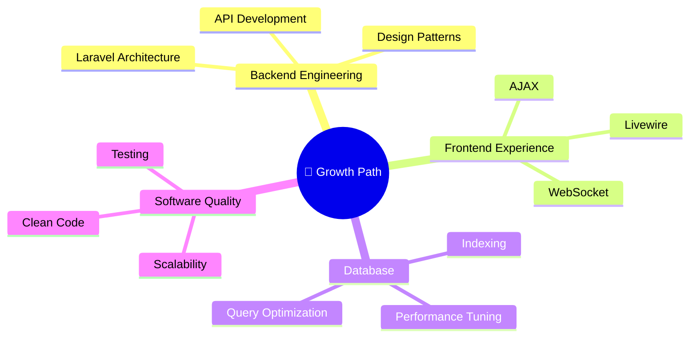

# 👋 Hi, I'm Salman Al Farisi

### Full-Stack Web Developer | Laravel • Django • Modern Web Solutions

 

---

### ✨ About Me

💻 Passionate Full-Stack Web Developer with strong experience in  
**Laravel, Django, PHP, Python, MySQL, and modern frontend technologies**

🚀 Focused on building **scalable systems, clean architecture, and intuitive UI/UX**

📈 Always learning about **software engineering best practices and performance optimization**

---

# 🛠 Tech Stack

### Backend

### Frontend

### Database & Tools

---

# 📊 GitHub Analytics

  
  <!--- Stats Cards Elegant --->
  <table align="center">
    <tr>
      <td align="center" width="200">
        <strong>📦 Repositories</strong> 
        5+
      </td>
      <td align="center" width="200">
        <strong>⚡ Status</strong> 
        Active
       </td>
      <td align="center" width="200">
        <strong>🎯 Focus</strong> 
        FullStack
       </td>
    </tr>
   </table>

   

  <!--- Tech Stack --->
  <table align="center">
    <tr>
      <td align="center">
        <code>PHP</code> • <code>Python</code> • <code>JavaScript</code> 
        <code>Laravel</code> • <code>Django</code> • <code>Tailwind</code>
       </td>
    </tr>
   </table>

   

  <!--- Featured Projects --->
  <table align="center">
    <tr>
      <td align="center">
        🛒 &nbsp; <strong>E-Commerce</strong> &nbsp; |
        📊 &nbsp; <strong>Dashboard</strong> &nbsp; |
        📋 &nbsp; <strong>Task Manager</strong> &nbsp; |
        🌐 &nbsp; <strong>Portfolio CMS</strong>
       </td>
    </tr>
   </table>

   

  <!--- Decorative Line --->
  

   

  <!--- Status Message --->
  
    ⚠️ <em>GitHub API sedang rate-limited — statistik detail akan muncul dalam beberapa jam</em>
  

    

  <!--- Profile Views --->
  
  
   

  <!--- Social Badges --->
  
  
  

---

# 🚀 Featured Projects

| Project | Description | Stack |
|:---|:---|:---|
| 🛒 **E-Commerce Platform** | Complete online store with authentication, cart, and payments | Laravel • MySQL • Tailwind |
| 📊 **Analytics Dashboard** | Realtime data monitoring and reporting dashboard | Django • Chart.js |
| 📋 **Task Management App** | Team collaboration and productivity system | Laravel • Livewire |
| 🌐 **Portfolio CMS** | Dynamic website management system | PHP • MySQL |

---

# 🎯 Current Focus

---

# 🌐 Connect With Me

---

  

### ✨ *"Code is poetry — every function tells a story."*

