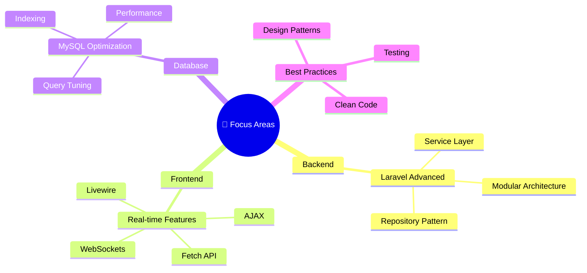

  

  

  
  

 

  <samp>
    <i>✨ Crafting digital solutions with modern tech stacks</i> 
    <i>💡 Passionate about clean code, scalable systems, and intuitive user experiences</i>
  </samp>

---

# 🚀 Tech Stack & Tools

| Category | Technologies |
|:---:|:---|
| **Backend** |     |
| **Frontend** |     |
| **Database** |  |
| **Tools** |    |

---

# 📊 GitHub Analytics

  
  

 

  

---

# 💼 Featured Projects

| Project | Description | Tech Stack |
|:---:|:---|:---|
| 🌐 **E-Commerce Platform** | Full-featured online store with payment integration | Laravel • MySQL • Tailwind |
| 📊 **Analytics Dashboard** | Real-time data visualization system | Django • Chart.js • PostgreSQL |
| 🎯 **Task Management App** | Collaborative project management | Laravel • Livewire • MySQL |
| 📱 **Portfolio CMS** | Dynamic content management system | PHP • MySQL • JavaScript |

---

# 🎯 Current Focus

---

# 📫 Let's Connect

  
  
  

---

  

   
  <i>✨ "Code is poetry — each function tells a story." ✨</i>

